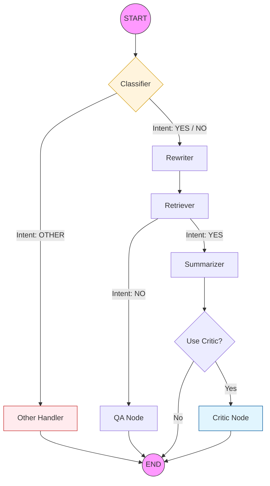
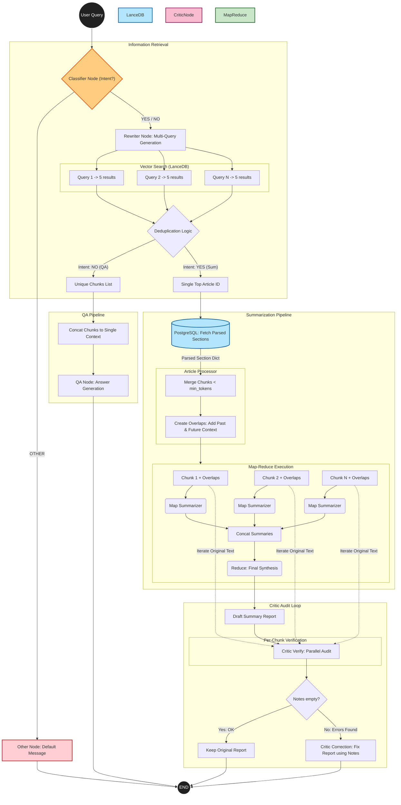
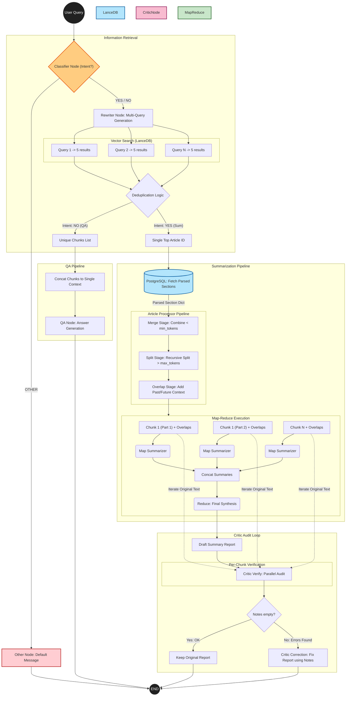

# AI-агент для поиска и суммаризации научных статей (arXiv.org)

Данный репозиторий содержит исходный код продвинутой системы для анализа научной литературы на базе LLM. Проект автоматизирует цикл работы с ArXiv: от интеллектуального поиска до формирования верифицированных обзоров длинных текстов.

## Архитектура системы
Поток управления реализован как граф состояний с помощью **LangGraph**. Это позволяет агенту гибко переключаться между стратегиями обработки в зависимости от контекста:

1.  **Intent Classifier** — Определяет цель пользователя:
    *   `summarize`: глубокая суммаризация одной статьи (Map-Reduce).
    *   `question`: поиск ответа по нескольким источникам (RAG).
    *   `other`: обработка нерелевантных запросов (приветствия, оффтоп).
2.  **Multi-Query Rewriter** — Генерирует список из 3–5 семантических вариаций запроса на английском языке, расширяя область поиска.
3.  **Advanced Retriever** — Выполняет параллельный поиск в **LanceDB** по всем вариациям запроса с последующей дедупликацией чанков.
4.  **Self-Correction (Critic Node)** — Опциональный модуль аудита. Сверяет финальный отчет с исходным текстом статьи, выявляет галлюцинации и при необходимости инициирует исправление отчета.

---

## Ключевые технические решения


### 1. Двухстадийный Article Processor (Merge & Split)
Для решения проблемы лимита контекста и сохранения структуры статьи реализован продвинутый алгоритм подготовки данных:
*   **Stage 1: Token-Aware Merging.** Мелкие подразделы статьи объединяются с соседями, пока не достигнут порога `min_tokens`. Это минимизирует количество вызовов LLM.
*   **Stage 2: Recursive Splitting.** Если после слияния или изначально секция превышает `max_tokens`, она рекурсивно разбивается на части. При этом сохраняется строгая нумерация в заголовках (например, *"Methodology (Part 1)"*), что помогает модели на этапе Map сохранять контекст.
*   **Stage 3: Custom Overlaps.** К каждому финальному чанку добавляются "теневые" контексты (`past_overlap` и `future_overlap`) из соседних фрагментов, обеспечивая плавность переходов в суммаризации.

### 2. Система верификации (Critic Loop)
В отличие от простых суммаризаторов, агент проводит финальный аудит:
*   **Parallel Audit:** Каждый оригинальный фрагмент текста сравнивается с итоговым отчетом.
*   **Error Classification:** Критик помечает ошибки типов `[NUM]` (цифры), `[TERM]` (термины) или `[LOGIC]`.
*   **Correction:** На основе собранных заметок модель делает финальный "чистовик".

---

## Отладка и мониторинг (Observability)

Система спроектирована как "прозрачный ящик". Весь процесс выполнения можно детально отследить двумя способами:

### 1. Интроспекция AgentState
Состояние агента (`AgentState`) доступно на каждом шаге и содержит полную историю работы:
*   `search_queries`: список всех переформулированных запросов.
*   `relevant_docs`: DataFrame со всеми найденными чанками и их метаданными.
*   `article_chunks`: полная структура статьи с добавленными контекстными перекрытиями.
*   `critic_notes`: подробный лог замечаний аудитора (если были найдены ошибки).
*   `debug_data`: промежуточные выжимки с этапа Map перед их финальным объединением.

### 2. Интеграция с LangSmith
Проект полностью интегрирован с платформой **LangSmith**, что дает следующие возможности:
*   **Визуализация графа:** Просмотр пути запроса через узлы и условные ребра.
*   **Трассировка (Tracing):** Пошаговый анализ времени выполнения и потребления токенов для каждой ноды.
*   **Управление промптами:** Все системные инструкции версионируются в Hub. Реализован **Fallback-механизм**: при отсутствии связи с облаком система автоматически переключается на локальный `prompts.yaml`.

---

## Стек технологий
*   **Ядро:** LangGraph, LangChain.
*   **LLM:** vLLM (инференс на GPU), OpenRouter (внешние модели).
*   **Хранение:** LanceDB (векторный поиск), PostgreSQL (полные тексты).
*   **NLP:** Sentence-Transformers, HuggingFace Transformers.
*   **Мониторинг:** LangSmith.

---

## Запуск проекта

### Настройка секретов
Создайте файл `.env`:
```text
OPENROUTER_API_KEY=your_key
LANGSMITH_API_KEY=your_key
HF_TOKEN=your_token
```

### Инициализация агента
```python
agent = ArxivAgent(
    llm_provider=provider,
    retriever=retriever,
    sum_pipeline=sum_pipe,
    processor=processor,
    embed_model=retrieval_model,
    db_params=db_params,
    tokenizer=tokenizer,
    prompts=hub_prompts_config, 
    use_critic=True, # Включить верификацию критиком
    use_hub=True     # Использовать LangSmith Hub
)

# Вызов агента
result = agent.invoke("Сделай детальный обзор статьи про обучение с подкреплением")
display(Markdown(result['final_answer']))
processor.visualize(result['debug_data'])
```





## Визуализация логики обработки (Детальный граф)

