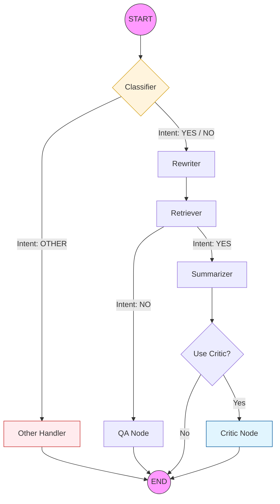

# AI-агент для поиска и суммаризации научных статей (arXiv.org)

Данный репозиторий содержит исходный код продвинутой системы для анализа научной литературы на базе LLM. Проект автоматизирует цикл работы с ArXiv: от интеллектуального поиска до формирования верифицированных обзоров длинных текстов.

## Архитектура системы
Поток управления реализован как граф состояний с помощью **LangGraph**. Это позволяет агенту гибко переключаться между стратегиями обработки в зависимости от контекста:

1.  **Intent Classifier** — Определяет цель пользователя:
    *   `summarize`: глубокая суммаризация одной статьи (Map-Reduce).
    *   `question`: поиск ответа по нескольким источникам (RAG).
    *   `other`: обработка нерелевантных запросов (приветствия, оффтоп).
2.  **Multi-Query Rewriter** — Генерирует список из 3–5 семантических вариаций запроса на английском языке, расширяя область поиска.
3.  **Advanced Retriever** — Выполняет параллельный поиск в **LanceDB** по всем вариациям запроса с последующей дедупликацией чанков.
4.  **Self-Correction (Critic Node)** — Опциональный модуль аудита. Сверяет финальный отчет с исходным текстом статьи, выявляет галлюцинации и при необходимости инициирует исправление отчета.

---

## Ключевые технические решения

### 1. Система самокоррекции (Critic Loop)
Для исключения фактических ошибок в научных отчетах внедрен механизм "критика":
*   **Verification:** Пакетная проверка каждого смыслового чанка статьи на соответствие итоговому отчету.
*   **Correction:** Если найдены несоответствия (неверные метрики, искаженные выводы), агент формирует список правок и пересобирает финальный текст.

### 2. Map-Reduce с контекстным перекрытием (Overlaps)
Для работы с длинными статьями используется кастомный алгоритм обработки:
*   **Context Overlaps:** К каждому чанку на этапе Map добавляется "память" (past/future overlap) — фрагменты соседних секций. Это сохраняет логическую связность на границах разделов.
*   **Section Merging:** Короткие подразделы объединяются до порога `min_tokens`, минимизируя количество вызовов API без потери контекста.

---

## Отладка и мониторинг (Observability)

Система спроектирована как "прозрачный ящик". Весь процесс выполнения можно детально отследить двумя способами:

### 1. Интроспекция AgentState
Состояние агента (`AgentState`) доступно на каждом шаге и содержит полную историю работы:
*   `search_queries`: список всех переформулированных запросов.
*   `relevant_docs`: DataFrame со всеми найденными чанками и их метаданными.
*   `article_chunks`: полная структура статьи с добавленными контекстными перекрытиями.
*   `critic_notes`: подробный лог замечаний аудитора (если были найдены ошибки).
*   `debug_data`: промежуточные выжимки с этапа Map перед их финальным объединением.

### 2. Интеграция с LangSmith
Проект полностью интегрирован с платформой **LangSmith**, что дает следующие возможности:
*   **Визуализация графа:** Просмотр пути запроса через узлы и условные ребра.
*   **Трассировка (Tracing):** Пошаговый анализ времени выполнения и потребления токенов для каждой ноды.
*   **Управление промптами:** Все системные инструкции версионируются в Hub. Реализован **Fallback-механизм**: при отсутствии связи с облаком система автоматически переключается на локальный `prompts.yaml`.

---

## Стек технологий
*   **Ядро:** LangGraph, LangChain.
*   **LLM:** vLLM (инференс на GPU), OpenRouter (внешние модели).
*   **Хранение:** LanceDB (векторный поиск), PostgreSQL (полные тексты).
*   **NLP:** Sentence-Transformers, HuggingFace Transformers.
*   **Мониторинг:** LangSmith.

---

## Запуск проекта

### Настройка секретов
Создайте файл `.env`:
```text
OPENROUTER_API_KEY=your_key
LANGSMITH_API_KEY=your_key
HF_TOKEN=your_token
```

### Инициализация агента
```python
agent = ArxivAgent(
    llm_provider=provider,
    retriever=retriever,
    sum_pipeline=sum_pipe,
    processor=processor,
    embed_model=retrieval_model,
    db_params=db_params,
    tokenizer=tokenizer,
    prompts=hub_prompts_config, 
    use_critic=True, # Включить верификацию критиком
    use_hub=True     # Использовать LangSmith Hub
)

# Вызов агента
result = agent.invoke("Сделай детальный обзор статьи про обучение с подкреплением")
display(Markdown(result['final_answer']))
processor.visualize(result['debug_data'])
```



```mermaid
graph TD
    %% ================= СТИЛИ =================
    style Start fill:#212121,stroke:#fff,stroke-width:2px,color:#fff
    style End fill:#212121,stroke:#fff,stroke-width:2px,color:#fff
    style Classifier fill:#ffcc80,stroke:#e65100,stroke-width:2px
    style Other fill:#ffcdd2,stroke:#b71c1c,stroke-width:2px
    style LanceDB fill:#b3e5fc,stroke:#01579b,stroke-width:2px
    style PostgreSQL fill:#b3e5fc,stroke:#01579b,stroke-width:2px
    style CriticCorrect fill:#f8bbd0,stroke:#880e4f,stroke-width:2px
    style MapReduce fill:#c8e6c9,stroke:#1b5e20,stroke-width:2px

    %% ================= ВХОД И РОУТИНГ =================
    Start((User Query)) --> Classifier{<b>Classifier Node</b><br/>Parse Intent}
    Classifier -->|OTHER| Other[<b>Other Node</b><br/>Return default message]
    Other --> End((END))

    %% ================= ПОИСКОВЫЙ БЛОК =================
    subgraph Information Retrieval
        direction TB
        Rewriter[<b>Rewriter Node</b><br/>Generate 3-5 sub-queries]
        LanceDB[(<b>LanceDB</b><br/>Vector Search)]
        Dedup{<b>Deduplication</b>}
        
        Classifier -->|YES / NO| Rewriter
        Rewriter --> LanceDB
        LanceDB --> Dedup
        
        Dedup -->|Intent: NO<br/>Drop by Chunk ID| DocsQA[Unique Chunks List]
        Dedup -->|Intent: YES<br/>Drop by Article ID| TopDoc[Single Top Article ID]
    end

    %% ================= ВЕТКА QA =================
    subgraph QA Pipeline
        direction TB
        QAContext[Concat all chunks into one context]
        QAGen[<b>QA Node (LLM)</b><br/>Generate Answer]
        
        DocsQA --> QAContext --> QAGen
    end
    QAGen --> End

    %% ================= ВЕТКА СУММАРИЗАЦИИ =================
    subgraph Summarization Pipeline
        direction TB
        PostgreSQL[(<b>PostgreSQL</b><br/>Full Text)]
        Parse[<b>Parser</b><br/>json.loads / ast.literal_eval]
        
        TopDoc --> PostgreSQL --> Parse
        
        subgraph Article Processor
            direction TB
            Merge[Merge chunks < min_tokens]
            Overlaps[<b>Create Overlaps</b><br/>Add Past & Future Context]
            Merge --> Overlaps
        end
        Parse --> Merge
        
        subgraph MapReduce [Map-Reduce Execution]
            direction LR
            C1[Chunk 1<br/>+ Context] --> M1(Map LLM)
            C2[Chunk 2<br/>+ Context] --> M2(Map LLM)
            CN[Chunk N<br/>+ Context] --> MN(Map LLM)
            
            M1 & M2 & MN --> Join[Concat Summaries] --> Reduce(<b>Reduce LLM</b><br/>Final Report)
        end
        Overlaps --> MapReduce
    end

    %% ================= ВЕТКА КРИТИКА =================
    subgraph Critic Audit Loop
        direction TB
        Verify[<b>Critic Verify (LLM)</b><br/>Compare Report vs EACH Original Chunk]
        CheckErrors{Notes empty?}
        CriticCorrect[<b>Critic Correction (LLM)</b><br/>Fix Report using Notes]
        
        Reduce --> Verify
        %% Пунктирная линия показывает, что Критик берет данные из Processor
        Overlaps -.->|Original Text| Verify 
        
        Verify --> CheckErrors
        CheckErrors -->|Yes: OK| FinalOk[Keep Original Report]
        CheckErrors -->|No: Found Errors| CriticCorrect
    end

    FinalOk --> End
    CriticCorrect --> End
```
